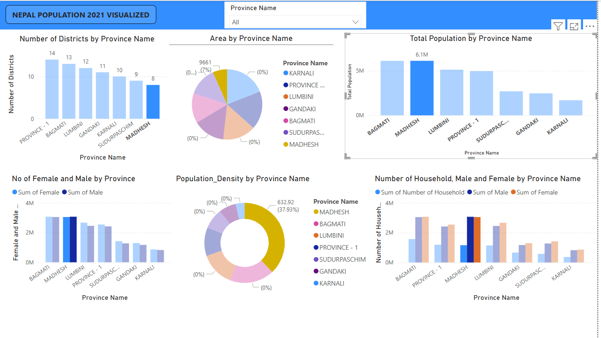
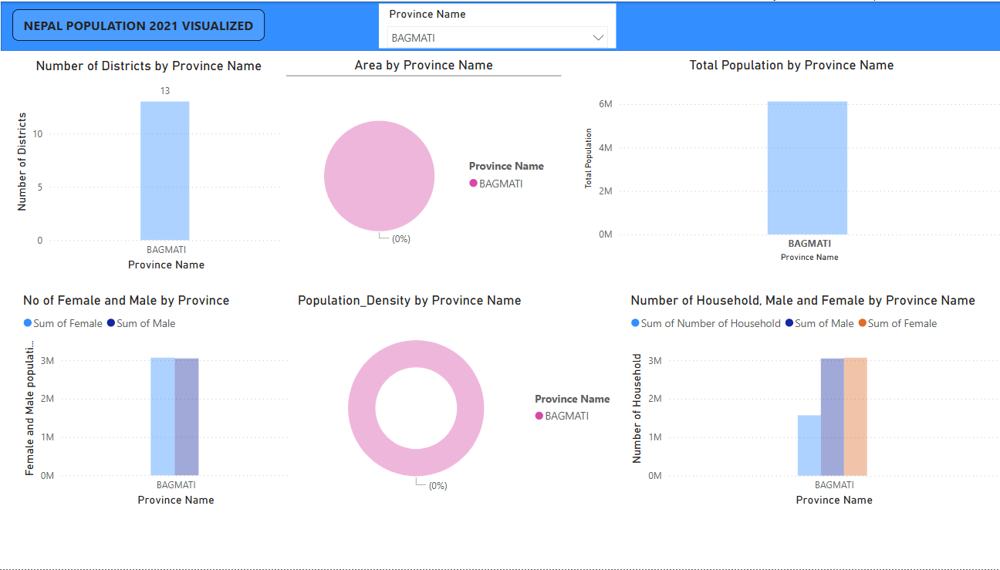

# Nepal Provincial Population Dashboard - Power BI

## Overview
This Power BI project visualizes provincial population data from the 2021 Nepal Census, sourced from the Central Bureau of Statistics (CBS) Nepal. The dashboard focuses on Nepal’s seven provinces, offering an interactive way to explore population distribution and key statistics at the provincial level. Designed to provide clear insights for researchers, students, and data enthusiasts.

## Features
- **Province-Level Filters**: Interactive slicers to view data for all provinces or drill down to a specific one.
- **Population Distribution**: Visuals showing total population across Nepal’s seven provinces.
- **Detailed Breakdown**: Metrics and visuals for a selected province (e.g., population by district within it).

## Screenshots
  
*Population distribution across all seven provinces.*  
  
*Detailed view of a single province’s population data.*

## Tools & Technologies
- **Power BI**: Dashboard creation and visualization.
- **Power Query**: Data cleaning and merging of Excel datasets.
- **DAX**: Calculated measures for summarizing provincial data.
- **Data Source**: Excel files from [CBS Nepal](https://censusnepal.cbs.gov.np/results).

## How It Works
1. Data was sourced from two Excel files: "District Population" and "Provincial Population," provided by CBS Nepal.
2. Processed in Power Query to merge datasets, clean inconsistencies, and aggregate district data into provincial totals.
3. Visualized with charts and tables to highlight provincial population trends.

## Sample Data
- See `Sample-Data/provincial-population-sample.xlsx` for an anonymized subset of the provincial dataset.

## Installation
1. Download `Nepal-Provincial-Population-Dashboard.pbix` from this repository (if included).
2. Open in Power BI Desktop.
3. Update data source paths to connect to your local copy of the sample data.

## Learnings
- Enhanced skills in merging and transforming Excel datasets with Power Query.
- Developed proficiency in designing province-focused visualizations in Power BI.

## Data Source
- **Central Bureau of Statistics Nepal**: [https://censusnepal.cbs.gov.np/results](https://censusnepal.cbs.gov.np/results)
- **National Report**: [National Report English PDF](https://censusnepal.cbs.gov.np/results/files/result-folder/National%20Report_English.pdf)
- **Datasets**: "District Population" and "Provincial Population" (Excel files).

## License
This project is licensed under the [MIT License](LICENSE).

## Contact
Reach out via [LinkedIn](www.linkedin.com/in/sagarshrestha17) or [bhabasagar17@gmail.com] for questions, feedback, or collaboration ideas!
